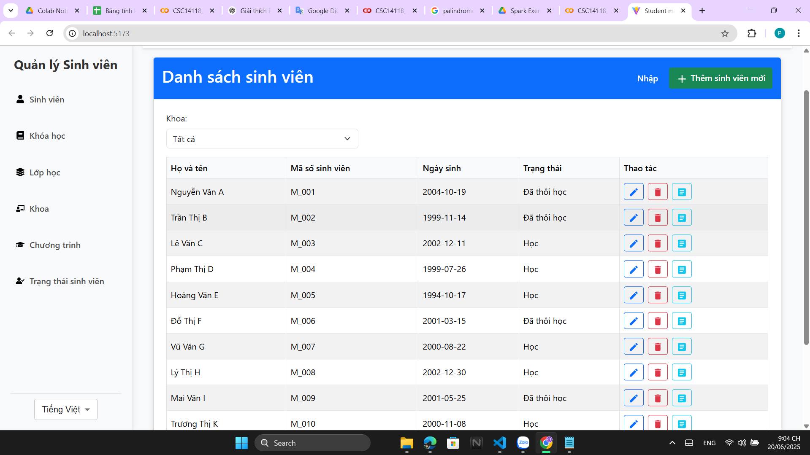
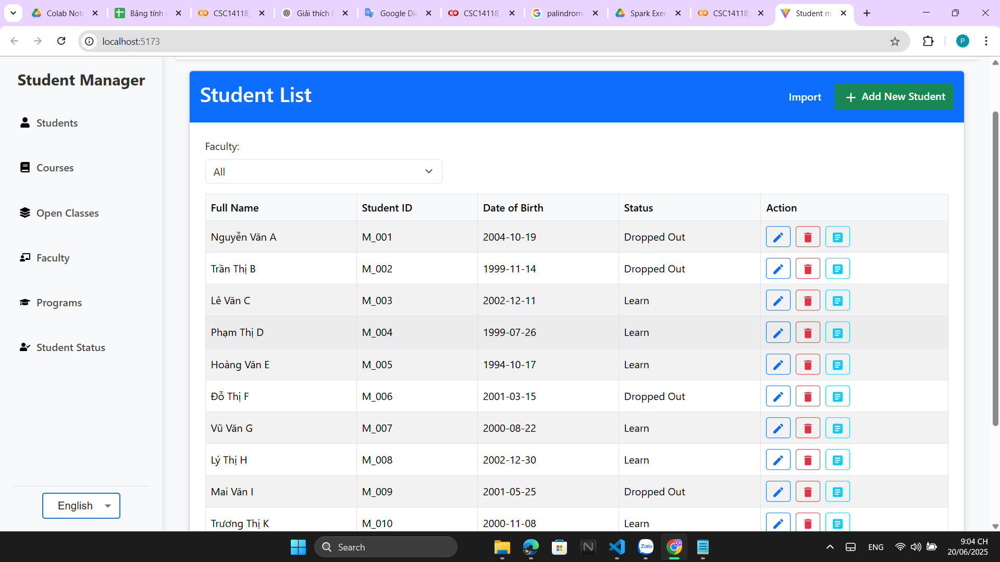

# Project Name

**Student Manager**

## 📁 Cấu trúc source code

### Tổng quan
- Source code gồm 2 phần chính: **client** (frontend) và **server** (backend)
- Mỗi phần được tổ chức theo cấu trúc module, với mỗi thư mục đại diện cho một tính năng hoặc thành phần riêng biệt

### Client (Frontend)
- **Framework**: React với TypeScript
- **Build tool**: Vite
- **Cấu trúc thư mục**:

```
client/
├── src/                        # Mã nguồn chính
│   ├── components/            # Các component UI
│   │   ├── common/           # Component dùng chung
│   │   ├── mainInformation/  # Component hiển thị thông tin chính
│   │   └── horizontalNav/    # Component thanh điều hướng ngang
│   ├── assets/               # Tài nguyên (hình ảnh, biểu tượng)
│   ├── App.tsx              # Component gốc của ứng dụng
│   └── main.tsx             # Điểm khởi đầu của ứng dụng
├── public/                   # Tệp tĩnh được phục vụ trực tiếp
└── [Cấu hình]               # vite.config.ts, tsconfig.json, eslint.config.js
```

### Server (Backend)
- **Framework**: NestJS với TypeScript
- **Database**: MongoDB
- **Cấu trúc thư mục**:

```
server/
├── src/                      # Mã nguồn chính của server
│   ├── common/              # Tiện ích, middleware, filter dùng chung
│   ├── config/              # Cấu hình ứng dụng
│   ├── types/               # Định nghĩa kiểu dữ liệu TypeScript
│   ├── [Modules]            # Các module chức năng:
│   │   ├── student/         # Quản lý thông tin sinh viên
│   │   ├── faculty/         # Quản lý khoa
│   │   ├── program/         # Quản lý chương trình học
│   │   ├── student_status/  # Quản lý tình trạng sinh viên
│   │   ├── course/          # Quản lý học phần
│   │   ├── enrollment/      # Quản lý đăng ký học phần
│   │   ├── transcript/      # Quản lý bảng điểm
│   │   ├── open_class/      # Quản lý mở lớp
│   │   ├── import/          # Chức năng nhập dữ liệu
│   │   └── export/          # Chức năng xuất dữ liệu
│   ├── app.module.ts        # Module gốc kết nối các module con
│   └── main.ts              # Điểm khởi đầu của server
├── dist/                    # Mã đã biên dịch
├── test/                    # Khởi tạo test
├── uploads/                 # Lưu trữ file tải lên
├── exports/                 # Lưu trữ file xuất ra
└── [Cấu hình]              # tsconfig.json, nest-cli.json, .env
```

**Lưu ý**: Mỗi module trong server được tổ chức theo mô hình MVC với:
- **Controller**: Xử lý HTTP request/response
- **Service**: Logic nghiệp vụ
- **DTO**: Data Transfer Object cho validation
- **Entity**: Định nghĩa cấu trúc dữ liệu
- **Repository**: Tương tác với database

## 🔧 Hướng dẫn cài đặt & chạy chương trình

### Yêu cầu hệ thống
- **Node.js**: phiên bản 16 trở lên
- **npm**: đi kèm với Node.js
- **MongoDB**: phiên bản 4.4 trở lên (cần cài đặt và chạy trước)

### Cấu hình môi trường

#### 1. Tạo file `.env` trong thư mục `migration`:
```env
MONGO_URI=mongodb://localhost:27017/student_management
```

#### 2. Tạo file `.env` trong thư mục `server`:
```env
NODE_ENV=development
MONGO_URI_DEV=mongodb://localhost:27017/student_management_dev
MONGO_URI_PROD=mongodb://localhost:27017/student_management_prod
PORT=3001
```

### Các bước cài đặt

#### Bước 1: Clone repository
```bash
git clone [repository-url]
cd Group12-Ex-Assignment1
```

#### Bước 2: Cài đặt dependencies gốc
```bash
npm install
```

#### Bước 3: Khởi động ứng dụng

Cần mở **3 terminal riêng biệt** và thực hiện theo thứ tự:

**Terminal 1 - Khởi tạo Database:**
```bash
cd migration
npm install
node migration.js
```
*Chờ quá trình migration hoàn tất trước khi chuyển sang bước tiếp theo*

**Terminal 2 - Chạy Backend Server:**
```bash
cd server
npm install
npm run start:dev
```
*Server sẽ chạy tại port 3001*

**Terminal 3 - Chạy Frontend Application:**
```bash
cd client
npm install
npm run dev
```
*Ứng dụng sẽ chạy tại port 5173*

### Truy cập ứng dụng
- **Frontend**: http://localhost:5173
- **Backend API**: http://localhost:3001
- **API Documentation**: http://localhost:3001/api

## 📖 Hướng dẫn đọc document

### Cách 1: Xem tài liệu trực tuyến

```bash
cd document
npm install
npm run start
```

Sau khi chạy lệnh, tài liệu sẽ được mở tự động trên trình duyệt. Nếu không tự động mở, truy cập: http://localhost:3000

### Cách 2: Xem tài liệu offline

Các file tài liệu được lưu trong thư mục `document/` với cấu trúc:
```
document/
├── api-spec/          # Đặc tả API chi tiết
├── database-design/   # Thiết kế cơ sở dữ liệu
├── user-guide/        # Hướng dẫn sử dụng
└── technical-spec/    # Đặc tả kỹ thuật
```

## Minh chứng chức năng

### Khoa

-   Quản lý khoa
    
-   Thêm khoa
    
-   Sửa khoa
    

### Chương trình

-   Quản lý chương trình
    
-   Thêm chương trình
    
-   Sửa chương trình
    

### Tình trạng

-   Quản lý tình trạng
    
-   Thêm tình trạng
    
-   Sửa tình trạng
    

### Tìm kiếm theo khoa + tên


### Xác thực số điện thoại


### Xác thực email


### Xác thực mã số sinh viên


### Xác thực tình trạng


### Tạo module

#### Course


#### Enrollment


#### Grade


#### Transcript


#### Open class

Open class home  
  
Open class add dialog  


#### Transcript
**Cách xem bảng điểm**
Vào trang Student, nhấn vào một student bất kỳ để xem bảng điểm của student đó


#### Register Course

Bước 1: Chọn vào biểu tượng chi tiết ở mỗi sinh viên trong trang student  
  
Bước 2: Kéo xuống cuối trang để thấy khu vực đăng ký học phần  


#### Multi-language
**Hệ thống hỗ trợ đa ngôn ngữ (tiếng Việt và tiếng Anh) cho giao diện người dùng.**

- Ứng dụng sử dụng thư viện [react-i18next](https://react.i18next.com/) để quản lý và chuyển đổi ngôn ngữ động trên frontend.
- Các trường dữ liệu đa ngôn ngữ (ví dụ: tên khoa, tên chương trình, tên học phần, tình trạng, giới tính, ...) đều được lưu trữ dưới dạng object:

```json
{
  "en": "English value",
  "vn": "Giá trị tiếng Việt"
}
```

- Người dùng có thể chuyển đổi ngôn ngữ giao diện bằng nút chọn ngôn ngữ trên thanh điều hướng.
- Khi chuyển đổi ngôn ngữ, toàn bộ giao diện và dữ liệu hiển thị sẽ tự động cập nhật theo ngôn ngữ đã chọn.
- Khi nhập dữ liệu mới, hệ thống sẽ tự động dịch sang ngôn ngữ còn lại bằng Google Translate API (có thể sửa lại thủ công nếu cần).
- Các file ngôn ngữ được lưu tại: `client/src/i18n/locales/vi/translation.json` và `client/src/i18n/locales/en/translation.json`.
- Để thêm/chỉnh sửa nội dung dịch, chỉ cần cập nhật các file JSON này.

**Ví dụ chuyển đổi ngôn ngữ:**

| Giao diện tiếng Việt | Giao diện tiếng Anh |
|---------------------|---------------------|
|  |  |

**Cách thêm ngôn ngữ mới:**
1. Tạo thư mục mới trong `client/src/i18n/locales/` với mã ngôn ngữ mới (ví dụ: `fr` cho tiếng Pháp).
2. Thêm file `translation.json` với nội dung dịch tương ứng.
3. Cập nhật cấu hình i18n để nhận diện ngôn ngữ mới.

**Lưu ý:**
- Một số trường hợp dịch tự động có thể không chính xác, nên kiểm tra lại nội dung dịch trước khi lưu.
- Backend lưu trữ song song cả hai ngôn ngữ cho các trường đa ngữ, đảm bảo API trả về đúng dữ liệu theo ngôn ngữ client yêu cầu.

